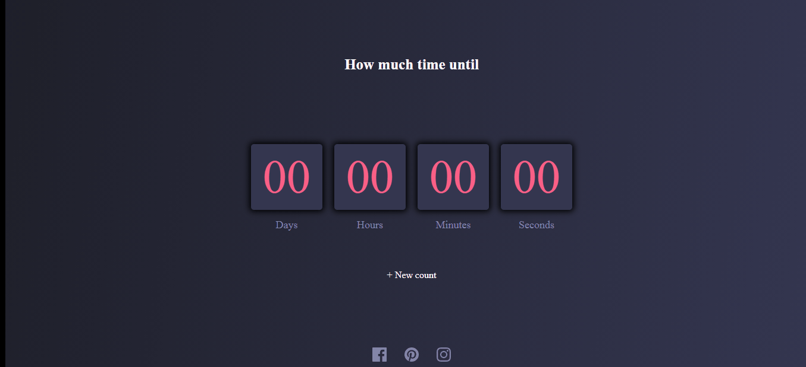

# Launch-countdown-timer

<h1 align="center"> Sobre o projeto </h2>

 Um countdown timer desenvolvido para praticar manipulação de datas com js onde o usuário insere uma data e é calculado quanto tempo falta desde a data atual até a data inserida.

<h2 align="center"> Tecnologias utilizadas </h2>

O projeto foi feito utilizando as 3 tecnologias bases do front-end que são: HTML, CSS e Javascript.

 O javascript foi responsável por pegar o valor da data inserida, verificar se o usuário realmente passou uma data, pegar a data atual fornecida pelo computador do usuário, calcular quantos dias, horas, minutos e segundos faltam até a data desejada e colocar na tela as informações atualizando a cada segundo. 

 

<h2 align="center"> Autor </h2>

<strong> Hamilton de Souza </strong>
 

